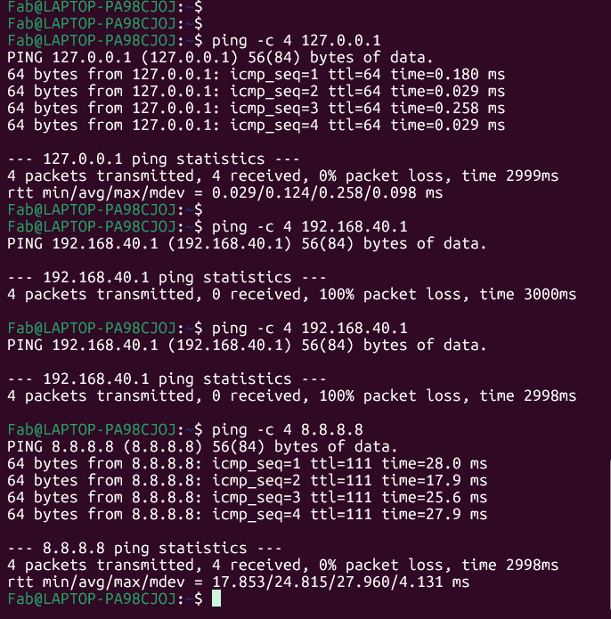
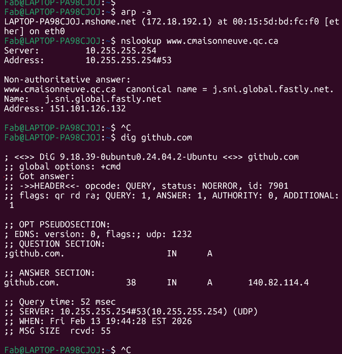
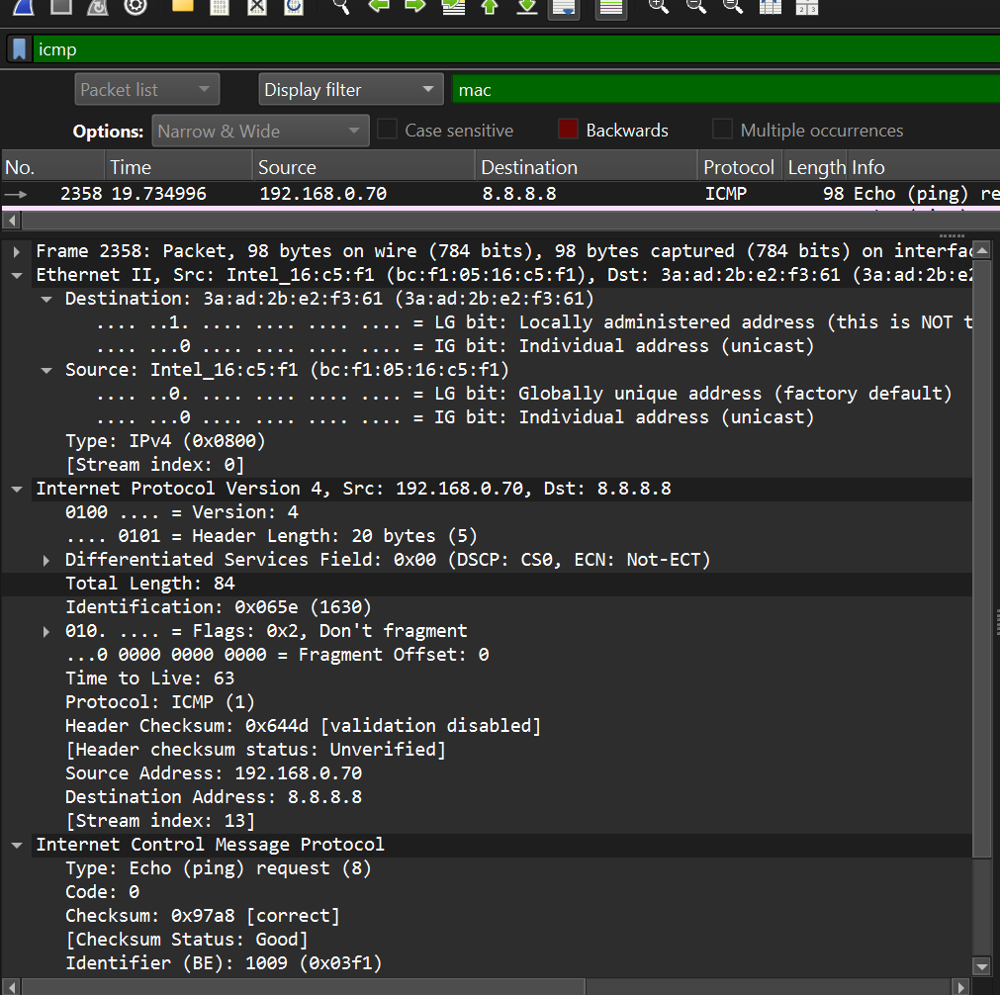
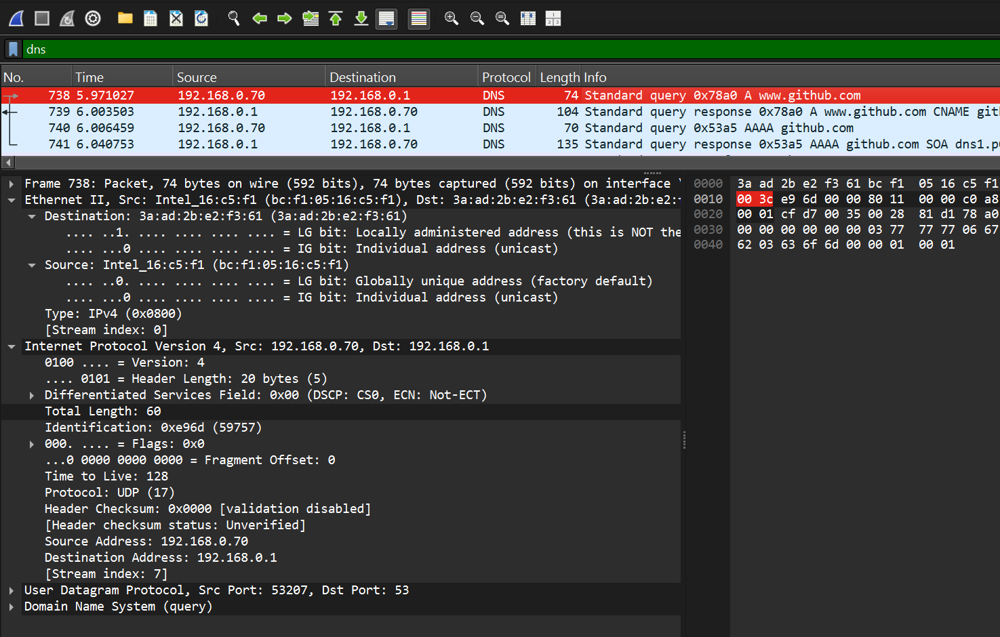
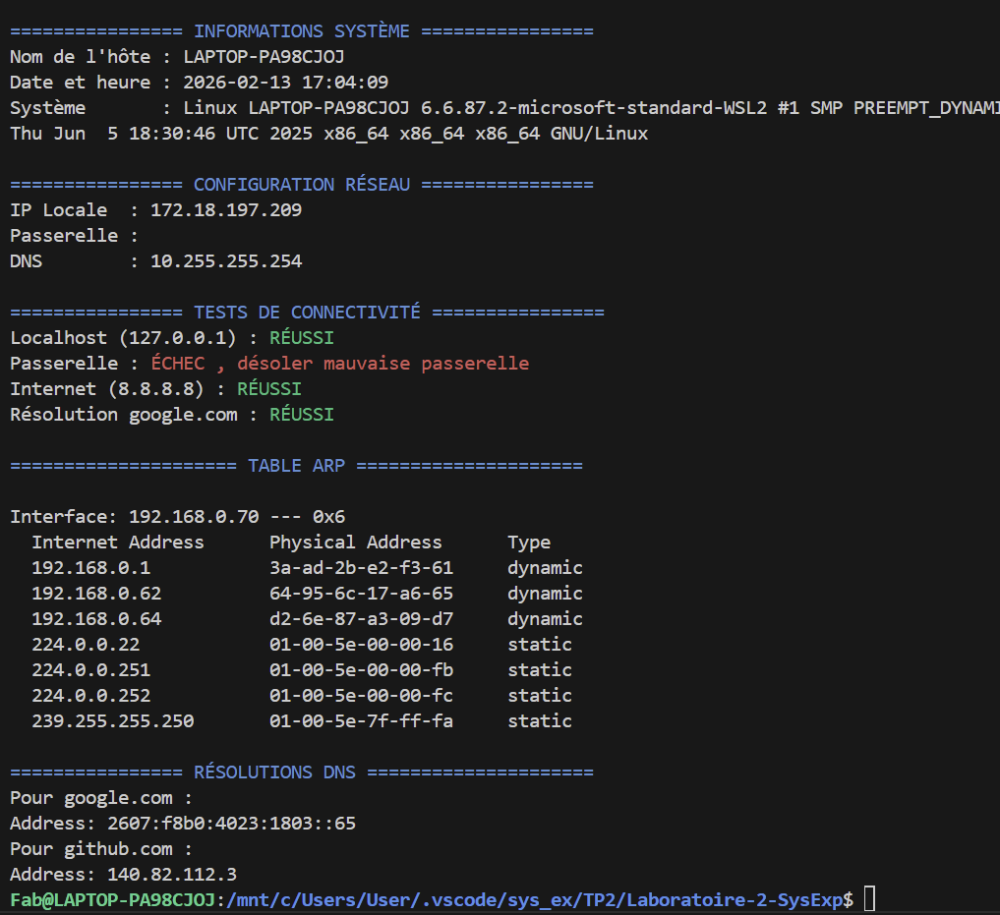

# Laboratoire 2 - Introduction aux Réseaux
## Systèmes d'exploitation - Collège de Maisonneuve

---

**Nom :** __Sainvry__

**Prénom :** ____Fabiola__

**Groupe :** _____________________

**Lien GitHub du devoir** : https://github.com/favry0001/TP2.git

**Date de remise :** Jeudi 13 février 2026
---

## Barème récapitulatif

| Section | Points | Note |
|---------|--------|------|
| Partie 1 : Questions théoriques | 20 | /20 |
| Partie 2 : Commandes réseau | 25 | /25 |
| Partie 3 : Analyse Wireshark | 25 | /25 |
| Partie 4 : Script Bash | 30 | /30 |
| **TOTAL** | **100** | **/100** |

---

# Partie 1 : Questions théoriques (20 points)

## Question 1 - Modèle OSI (5 points)

### a) Complétez le tableau (2.5 pts)

| Protocole/Élément | N° Couche | Nom de la couche |
|-------------------|-----------|------------------|
| HTTP | 7|Application |
| Adresse IP | 3|	Réseau |
| Câble Ethernet | 1| 		Physique|
| TCP | 4|	Transport |
| Adresse MAC | 2|Liaison |

### b) Différence entre le modèle OSI et TCP/IP (2.5 pts)

```
Le modèle OSI  est un modèle théorique à qui separe les 7 couches qui ,en théorie 7 fonctions diferents, alors que le modèle TCP/IP est le modèle pratique utilisé sur Internet, structuré en 4 couches qui regroupe plusieur sous-couche car ils ont la même nature. 


```

---

## Question 2 - Adresses IP (5 points)

### a) Adresses privées ou publiques (2.5 pts)

| Adresse IP | Privée / Publique |
|------------|-------------------|
| 192.168.1.50 | Privée|
| 8.8.8.8 | Publique |
| 10.0.0.1 |Publique  |
| 172.20.5.100 | Privée|
| 200.100.50.25 | Publique|

### b) Qu'est-ce qu'un masque de sous-réseau ? À quoi sert-il ? (2.5 pts)

```
c'est une thecnique qui te permet de diferencier la partie Réseau et la partie de ta machine le HÔTE et de savoir si une autre machine est sur le même réseau que lui ou sur un réseau distant.

```

---

## Question 3 - Protocoles (10 points)

### a) Expliquez le fonctionnement du protocole ARP. Pourquoi est-il nécessaire ? (3 pts)

```
Ce protocole transforme une adresse IP en adresse physique MAC, ce qui permet la communication des données parmis plusieurs couches.

```

### b) Différence entre une requête DNS de type A et de type AAAA ? (2 pts)

```
la différence c'est que le DNS type A est une serie de 32 bits, et c'est le plus commun a avoir dans ton local et ça l'aire d'un 192.168.1.1 alors que, celui de type AAAA a une série de chiffres hexadécimaux beaucoup plus longue exactement 128 bits.


```

### c) Expliquez ce que fait la commande `ping` au niveau du protocole ICMP. Quels types de messages sont échangés ? (3 pts)

```
ping est utilisée pour envoyer des messages de diagnostic et d'erreur afin de vérifier la connexion entre deux réseaux.


```

### d) Sur quel port et avec quel protocole de transport fonctionne DNS par défaut ? Pourquoi ce choix ? (2 pts)

```
C'est toujours le port 53 avec le datagramme protocole, car c'est rapide et léger pour les requêtes courtes comme celles du DNS.

```

---

# Partie 2 : Commandes réseau (25 points)

## Exercice 1 : Configuration réseau (10 points)

### a) Configuration réseau

**Commande utilisée :**
```bash
ip addr show | grep "inet " 
```

**Adresse IP :**
```
172.18.197.209
```

**Masque de sous-réseau :**
```
/20
```

**Nom de l'interface réseau principale :**
```
eth0
```

### b) Passerelle par défaut

**Commande utilisée :**
```bash
ip route
```

**Adresse de la passerelle :**
```
172.18.192.1
```

### c) Serveurs DNS

**Commande utilisée :**
```bash
cat /etc/resolv.conf
```

**Serveurs DNS configurés :**
```
10.255.255.254
```

> 📸 **Capture d'écran 1** : Insérez votre capture montrant la configuration réseau
> 
>

---

## Exercice 2 : Tests de connectivité avec ping (8 points)

### a) Ping vers localhost (127.0.0.1) - 4 paquets

**Commande exacte utilisée :**
```bash
ping -c 4 127.0.0.1
```

**Résultat (succès/échec) :**
```
succès
```

**Temps moyen de réponse :**
```
 0.124ms
```

### b) Ping vers la passerelle - 4 paquets

**Résultat (succès/échec) :**
```
échec
```

**Temps moyen de réponse :**
```
2998ms
```

### c) Ping vers 8.8.8.8 - 4 paquets

**Résultat (succès/échec) :**
```
succès
```

**Temps moyen de réponse :**
```
24.815ms
```

### d) Si le ping vers 8.8.8.8 fonctionne mais pas vers google.com, quel serait le problème probable ?

```
C'est un problème de DNS


```

> 📸 **Capture d'écran 2** : Insérez votre capture des tests ping
> 
> >

---

## Exercice 3 : Table ARP et résolution DNS (7 points)

### a) Table ARP

**Commande utilisée :**
```bash
arp -a
```

**Nombre d'entrées :**
```
1
```

**Une entrée (IP et MAC) :**
```
172.18.192.1
```

### b) Requête DNS pour www.collegemaisonneuve.qc.ca

**Commande utilisée :**
```bash
nslookup www.cmaisonneuve.qc.ca
```

**Adresse IP obtenue :**
```
151.101.126.132
```

### c) Commande `dig` pour github.com - TTL

**TTL (Time To Live) de l'enregistrement :**
```
    38      IN      A       140.82.114.4
```

> 📸 **Capture d'écran 3** : Insérez votre capture de la table ARP et d'une requête DNS
> 
> >

---

# Partie 3 : Analyse Wireshark (25 points)

## Exercice 4 : Capture et analyse ICMP (10 points)

### Analyse d'un paquet "Echo (ping) request"

| Information | Valeur observée |
|-------------|-----------------|
| Adresse MAC source | bc:f1:05:16:c5:f1|
| Adresse MAC destination | 3a:ad:2b:e2:f3:61|
| Adresse IP source |192.168.0.70 |
| Adresse IP destination |8.8.8.8 |
| Type ICMP (numéro) | 8|
| Code ICMP | 0|

### Question : Différence entre le Type ICMP d'un "Echo Request" et d'un "Echo Reply" ?

```
La différence est dans les type de demandes

```

> 📸 **Capture d'écran 4** : Capture Wireshark montrant les paquets ICMP avec le détail d'un paquet
> 
> 

---

## Exercice 5 : Capture et analyse DNS (8 points)

### Analyse de la requête et réponse DNS

| Information | Valeur observée |
|-------------|-----------------|
| Port source (requête) | 53207|
| Port destination (requête) | 53|
| Protocole de transport |UDP (17) |
| Type de requête DNS | A (IPv4)|
| Adresse IP dans la réponse | 20.205.243.166|

> 📸 **Capture d'écran 5** : Capture Wireshark montrant la requête et réponse DNS
> 
> 

---

## Exercice 6 : Capture et analyse ARP (7 points)

### Tableau d'un échange ARP observé

| Information | ARP Request | ARP Reply |
|-------------|-------------|-----------|
| Adresse MAC source | 3a:ad:2b:e2:f3:61|3a:ad:2b:e2:f3:61 |
| Adresse MAC destination |ff:ff:ff:ff:ff:ff | 00:00:00:00:00:00|
| Adresse IP recherchée |192.168.0.55 | |

### Question : Pourquoi l'adresse MAC de destination dans l'ARP Request est-elle `ff:ff:ff:ff:ff:ff` ?

```
L'adresse MAC de destination est ff:ff:ff:ff:ff:ff parce qu'il s'agit d'une adresse de diffusion qui est le Broadcast


```

> 📸 **Capture d'écran 6** : Capture Wireshark montrant l'échange ARP
> 
> 

---

# Partie 4 : Script de diagnostic réseau (30 points)

## Exercice 7 : Création du script

### Informations sur votre script

**Nom du fichier :** `diagnostic_reseau.sh`

### Checklist des fonctionnalités implémentées

Cochez les fonctionnalités que vous avez implémentées :

- [x] Affichage du nom de l'hôte
- [x] Affichage de la date et heure
- [x] Affichage de la version du système
- [x] Affichage de l'adresse IP locale
- [x] Affichage de l'adresse de la passerelle
- [x] Affichage des serveurs DNS
- [x] Test de connectivité localhost
- [x] Test de connectivité passerelle
- [x] Test de connectivité Internet (8.8.8.8)
- [x] Test de résolution DNS (google.com)
- [x] Affichage de la table ARP
- [x] Résolution DNS de 2+ domaines
- [x] Gestion des erreurs (messages si échec)
- [x] Commentaires dans le code
- [x] Affichage clair avec titres de sections

### Difficultés rencontrées (optionnel)

```
Décrivez ici les difficultés que vous avez rencontrées lors de la création du script :


```

> 📸 **Capture d'écran 7** : Capture montrant l'exécution de votre script
> 
> 

---

# Récapitulatif de la remise

## Fichiers à inclure dans votre projet

Vérifiez que votre projet contient :

- [x] `reponse.md` (ce fichier complété)
- [X] `diagnostic_reseau.sh` (votre script)
- [x] `captures/capture1_config_reseau.png`
- [x] `captures/capture2_ping.png`
- [x] `captures/capture3_arp_dns.png`
- [x] `captures/capture4_wireshark_icmp.png`
- [x] `captures/capture5_wireshark_dns.png`
- [x] `captures/capture6_wireshark_arp.png`
- [X] `captures/capture7_script_execution.png`

---


---

*Bon travail !*